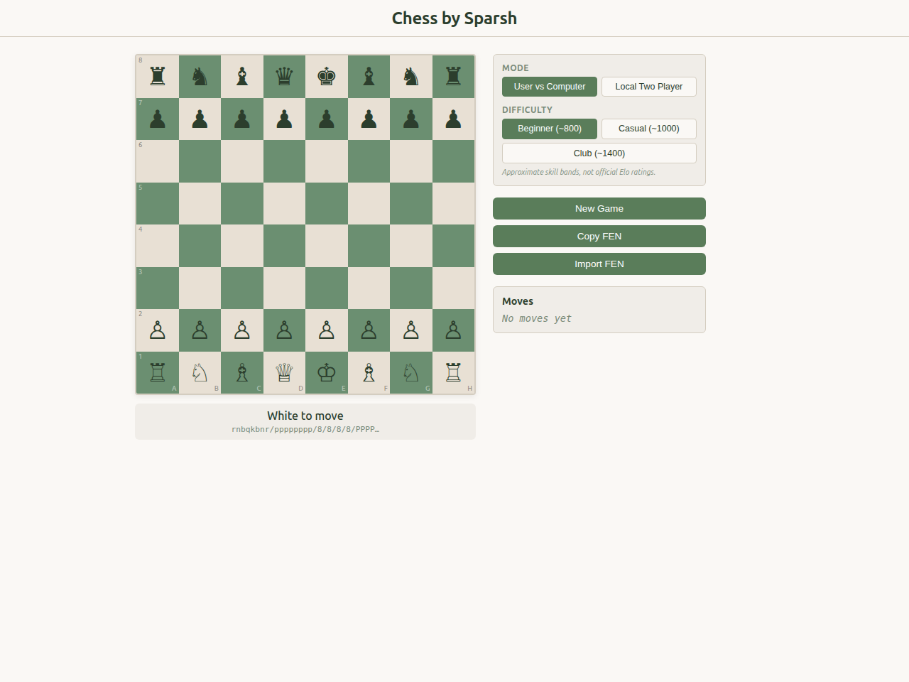

<div align="center">
  <br />
  
  <br /><br />
  <h1>Chess by Sparsh</h1>
  <p><em>A local-first chess board with accurate rule validation and a calm, readable interface.</em></p>
  <p><strong>Play the computer or a friend. No accounts, no backend, no telemetry.</strong></p>
  <br />
  <div>
    
    
    
    
    
    
    
    
  </div>
  <br />
  <p>
    <a href="https://chess-by-sparsh.vercel.app" target="_blank"><strong>Live Demo →</strong></a>
    &nbsp;&nbsp;·&nbsp;&nbsp;
    <a href="#quick-start"><strong>Quick Start</strong></a>
    &nbsp;&nbsp;·&nbsp;&nbsp;
    <a href="#features"><strong>Features</strong></a>
    &nbsp;&nbsp;·&nbsp;&nbsp;
    <a href="#computer-opponent"><strong>Computer Opponent</strong></a>
    &nbsp;&nbsp;·&nbsp;&nbsp;
    <a href="#architecture"><strong>Architecture</strong></a>
  </p>
  <br />
</div>

---

## What is Chess by Sparsh?

Chess by Sparsh is a **local-first chess board** built for clean, focused play. It supports both human-vs-human and human-vs-computer modes with three rating-inspired difficulty bands — all inside a simple browser app with no backend, no accounts, and no telemetry.

The product is designed around one idea: chess should be easy to start, locally owned, and free from platform noise.

### What it IS:
- A clean browser-based chess board with legal move highlighting
- User vs Computer mode with three difficulty bands
- Local Two Player mode on the same device
- FEN import and export for portable game state
- PGN export (clipboard + download)
- Browser-local persistence (game state + preferences)
- Accurate chess rule validation via chess.js
- A settings panel for game mode, difficulty, and board orientation
- Undo, restart, and resign support
- Move review / step-through mode
- Captured pieces display
- Board color themes (Classic, Marine, Ember, Forest, Midnight)
- Multiple piece rendering sets (Unicode, Symbols, Outlined)
- Web Audio API sound effects (moves, captures, checks, checkmate)
- Warm, cozy UI with a carpet texture background

### What it IS NOT:
- Not an online multiplayer platform
- Not a Stockfish or engine analysis tool
- Not a rating or tournament system
- Not a subscription or paid service
- Not a data collection / telemetry system
- Not a mobile app (responsive web only)

---

## Quick Start

### Requirements
- Node.js 20+ and npm

### Install & run
```bash
npm install
npm run dev
```

### Build & preview
```bash
npm run build
npm run preview
```

### Test & lint
```bash
npm test
npm run lint
```

---

## Features

| Capability | Status |
|---|---:|
| Custom 8x8 chess board | Complete |
| Unicode chess pieces | Complete |
| Click-to-select movement | Complete |
| Legal move highlighting | Complete |
| Legal move validation through `chess.js` | Complete |
| Castling, en passant, check, checkmate, stalemate, draw handling | Complete |
| Pawn promotion dialog | Complete |
| Algebraic move history | Complete |
| FEN export / import | Complete |
| Browser-local game persistence | Complete |
| Responsive layout | Complete |
| Rule-focused test coverage | Complete |
| **Computer opponent (5 levels, incl. Stockfish Nightmare)** | **Complete (v0.5.0)** |
| **Settings panel** | **Complete** |
| **Game mode switching** | **Complete** |
| **Board orientation setting** | **Complete** |
| **Settings persistence** | **Complete** |
| **Warm carpet texture background** | **Complete (v0.4.0)** |
| **Undo move** | **Complete (v0.4.0)** |
| **Restart game** | **Complete (v0.4.0)** |
| **Resign game** | **Complete (v0.4.0)** |
| **PGN export (clipboard + download)** | **Complete (v0.4.0)** |
| **Captured pieces display** | **Complete (v0.4.0)** |
| **Move review / step-through mode** | **Complete (v0.4.0)** |
| **Board color themes (5 themes)** | **Complete (v0.4.0)** |
| **Piece rendering sets (3 styles)** | **Complete (v0.4.0)** |
| **Sound effects (Web Audio API)** | **Complete (v0.4.0)** |
| **Mobile layout improvements** | **Complete (v0.4.0)** |

### Computer Opponent

| Difficulty | ~Rating | Behavior |
|---|---|---|
| Beginner | 800 | Weighted random — center preference, capture bonus, occasional blunders |
| Casual | 1000 | 1-ply minimax — captures hanging pieces, avoids blunders |
| Club | 1450 | 3-ply alpha-beta + quiescence — move/undo search, node budget, opening book (6 plies), tuned eval weights |
| Expert | 1750 | 5-ply iterative deepening + TT + quiescence — opening book, improved eval, node budget |
| Nightmare | 2000+ | **Stockfish WASM** — real chess engine in the browser. ~2.5s think time. Loaded on demand. |

> Rating-inspired skill bands, not official Elo ratings.

> ⚠ **Nightmare difficulty** requires a modern browser with SharedArrayBuffer support. See [Browser Requirements](#browser-requirements) below.

---

## Architecture

Chess by Sparsh is a single-page React application with no backend dependencies. All game logic runs client-side.

**Data flow:** User interaction → React event handler → chess.js rule validation → state update via hooks → React re-render → board display.

**AI pipeline (Beginner–Expert):** Game state → difficulty adapter → evaluation function → minimax search (alpha-beta at Club level) → move selection → promise-based async delay → board update.

**AI pipeline (Nightmare):** Game state → UCI protocol → Stockfish WASM engine → `bestmove` callback → board update.

```
┌────────────────────────────────────────────────────────────┐
│                       React App                            │
│                                                            │
│  ┌──────────┐   ┌──────────────┐   ┌──────────────────┐   │
│  │  Board    │   │  GameControls │   │   StatusBar      │   │
│  │ + Square  │   │  MoveHistory │   │  (+ Stockfish    │   │
│  └─────┬────┘   └──────┬───────┘   │   progress)       │   │
│        │              │            └────────┬─────────┘   │
│  ┌─────┴──────────────┴─────────────────────┴─────────┐   │
│  │              useChessGame hook                       │   │
│  │   (state + computer scheduling + persistence         │   │
│  │    + Stockfish lifecycle)                            │   │
│  └─────┬───────────────────────────────────────────────┘   │
│        │                                                    │
│  ┌─────┴───────────────────────┐   ┌─────────────────────┐  │
│  │    chess.js rules library   │   │  StockfishEngine     │  │
│  │ (moves, validation, game   │   │  (UCI wrapper)       │  │
│  │  over detection)            │   │  ─── dynamically     │  │
│  └─────────────────────────────┘   │  imported            │  │
│                                    └─────────┬───────────┘  │
│  ┌──────────────┐   ┌──────────────┐         │              │
│  │  AI Engine   │   │  localStorage │         │              │
│  │  minimax     │   │ (save/load)  │         ▼              │
│  │  evaluate    │   └──────────────┘   stockfish.wasm      │
│  │  PST         │                       (WASM + worker)     │
│  └──────────────┘                                         │
└────────────────────────────────────────────────────────────┘
```

### Stockfish Integration

Nightmare difficulty uses [`stockfish.wasm@0.10.0`](https://github.com/niklasf/stockfish.wasm) — the same WebAssembly port that powers Lichess analysis. Key details:

- **Lazy loading:** The engine is dynamically imported only when Nightmare is selected. It is NOT loaded on app startup.
- **UCI protocol:** Communication via the Universal Chess Interface protocol.
- **Web Workers:** Uses SharedArrayBuffer + Web Workers for threading.
- **Cleanup:** The engine is terminated when switching away from Nightmare or unmounting the app.
- **Progress:** Real-time depth and evaluation scores are shown in the status bar while the engine thinks.

```
view/hook ──> StockfishEngine.init() ──> dynamic import('stockfish.wasm')
                │
                ├──> Stockfish() ──> Emscripten WASM loader ──> stockfish.worker.js
                │
                ├──> waitForMessage('uciok') + 'readyok'
                │
                └──> engine.search(fen, thinkTimeMs)
                        │
                        ├──> 'info depth X score cp YYY' (real-time progress)
                        │
                        └──> 'bestmove e2e4' (final move callback)

---

## Project Principles

1. **Correctness before novelty** — rules and state handling matter more than feature volume.
2. **Small surface area** — the app should remain easy to inspect, test, and maintain.
3. **Local-first by default** — local play should not require a backend service.
4. **Portable records** — FEN support should make game state easy to move and inspect.
5. **Restrained claims** — this is a chess board, not a chess engine or rating system.

---

## Repository Structure

```text
.
├── .github/
│   ├── workflows/ci.yml
│   ├── FUNDING.yml
│   ├── pull_request_template.md
│   └── ISSUE_TEMPLATE/
│       ├── bug_report.md
│       └── feature_request.md
├── assets/
│   ├── backgrounds/
│   │   └── carpet-texture.png      ← Warm background texture
│   └── screenshots/
│       └── chess-main.png
├── src/
│   ├── app/                  — App.tsx, App.css, main.tsx, main.css
│   ├── chess/                — AI engine (computer, evaluate, PST, difficulty)
│   ├── components/
│   │   ├── Board/            — Board.tsx, Square.tsx
│   │   ├── CapturedPieces/  — CapturedPieces.tsx ← New in v0.4.0
│   │   ├── ConfirmDialog/   — ConfirmDialog.tsx  ← New in v0.4.0
│   │   ├── Game/             — MoveHistory.tsx, StatusBar.tsx
│   │   ├── GameControls/     — GameControls.tsx
│   │   ├── Piece/            — Piece.tsx
│   │   ├── PromotionDialog/  — PromotionDialog.tsx
│   │   └── Settings/         — SettingsPanel, ModeSelector, DifficultySelector
│   ├── hooks/                — useChessGame.ts, useSettings.ts
│   ├── lib/                  — storage.ts, sounds.ts ← New in v0.4.0
│   └── types/                — types.ts
├── ARCHITECTURE.md
├── ROADMAP.md
├── CHANGELOG.md
├── AGENTS.md
├── CONTRIBUTING.md
├── SECURITY.md
└── package.json
```

---

## Tech Stack

| Layer | Choice |
|---|---|
| Frontend | React + TypeScript |
| Build tool | Vite |
| Chess rules | `chess.js` |
| Board UI | Custom-rendered board |
| AI | Heuristic minimax (no external engines) |
| Sound | Web Audio API (no audio files) |
| Testing | Vitest + Testing Library |
| Persistence | localStorage |
| Deployment | Vercel |

---

## Board Themes

Choose from five board color themes in the Settings panel:

- **Classic** — Light #e8e0d4, Dark #6b8f71 (default)
- **Marine** — Light #dee4ea, Dark #5a7d9a
- **Ember** — Light #f5e0c3, Dark #b8623a
- **Forest** — Light #d4d9a8, Dark #4a6b3a
- **Midnight** — Light #c8ccd0, Dark #3d4a5c

---

## Piece Sets

Three piece rendering styles:

- **Unicode** — Standard chess Unicode characters (default)
- **Symbols** — Warm golden/amber tones for a unique look
- **Outlined** — Transparent pieces with visible outlines

---

## Sound Effects

Sounds are generated programmatically using the Web Audio API — no audio files needed. Each action has a distinct sound:

- **Move** — Short soft click
- **Capture** — Lower, slightly louder thud
- **Check** — Urgent double beep
- **Checkmate** — Triumphant rising tone
- **Promotion** — Bright ascending note

Sound can be toggled on/off in the Settings panel.

---

## Mobile Support

The app is fully responsive and works on mobile devices:

- Controls and move history appear below the board on small screens
- Touch-friendly 44px minimum button heights
- Full-width settings overlay
- Collapsible move history
- Board automatically sizes to `min(92vw, 400px)`

---

## Browser Requirements

While the core app works in any modern browser, **Nightmare difficulty** requires:

- **WebAssembly threading support** (enabled by default in modern browsers)
- **`SharedArrayBuffer`** API
- **`Atomics`** API
- **Proper HTTP headers:** `Cross-Origin-Embedder-Policy: require-corp` and `Cross-Origin-Opener-Policy: same-origin`

**Supported:** Chrome 79+, Edge 79+, Firefox 79+ (desktop only)
**Not supported:** Safari, mobile browsers, older browsers

### Self-hosting

If you deploy this app on your own server, ensure the following headers are set on the top-level response:

```
Cross-Origin-Embedder-Policy: require-corp
Cross-Origin-Opener-Policy: same-origin
```

For Vercel deployments, `vercel.json` handles this automatically. For local development, Vite's dev server is configured with these headers.

### Feature Detection

The app includes `isWasmThreadsSupported()` to check at runtime whether the browser supports Stockfish. If unsupported, a clear error message is shown in the UI.

---

## Deliberately Out of Scope

The following are intentionally deferred:

- Online multiplayer
- User accounts
- Engine analysis (beyond playing against Stockfish)
- Ratings, matchmaking, ladders, or tournaments
- Server-side database storage
- PGN import
- Drag-and-drop movement
- Clocks or timed play

No roadmap item should be treated as promised until it is implemented, tested, and released.

---

## Roadmap

| Version | Direction |
|---|---|
| `v0.1.x` | Local play foundation — board, rules, moves, FEN, persistence |
| `v0.2.x` | Computer opponent, settings panel, game mode switching |
| `v0.3.x` | Engine Strength Release: Club/Expert engine upgrade, quiescence, TT, MVV-LVA, improved eval |
| `v0.4.x` | **Gameplay Product Polish: Undo, resign, PGN, themes, piece sets, sound, mobile** |
| `v0.5.x` | **Stockfish Nightmare Release: Real chess engine integration via WASM** |
| `v0.6.x` | Optional engine-assisted analysis with clear labeling |
| `v0.7.x` | Optional online play after design boundaries are documented |

See [ROADMAP.md](ROADMAP.md) for the full versioned roadmap with principles and scope guidance.

---

## License

MIT — see [LICENSE](LICENSE).

## Maintainer

Created by [Sparsh Sam](https://github.com/sparshsam).
